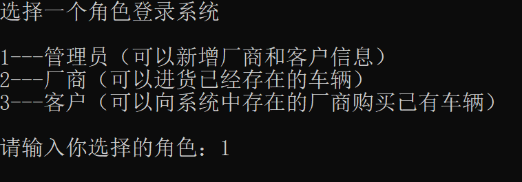
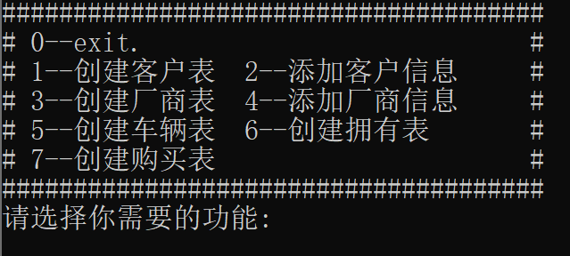
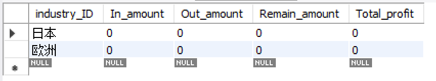
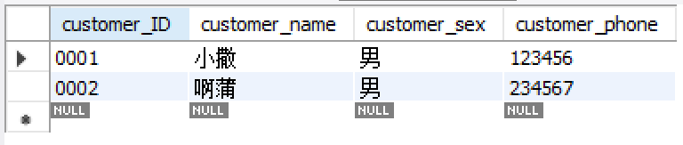

# 数据库系统 课程设计报告

#### 题目：汽车销售管理系统

| 姓名 | 学号 | 班级 | 分工               |
| ---- | ---- | ---- | ------------------ |
| CCY  |      |      | 代码编写、报告撰写 |
| TRY  |      |      | 代码编写、报告撰写 |


## 1 开发环境与开发工具

- 开发环境：windows

- 开发工具：mysql 3.7.31, mysql workbench, visual studio 2017


## 2 系统需求分析

### 2.1 功能分析

- 基础信息管理：
  - 厂商信息管理：查询、增、删、改
  - 车型信息管理：查询、增、删、改
  - 客户信息管理：查询、增、删、改
- 进货管理：
  - 车辆采购信息的管理：查询、增、删、改
  - 车辆入库信息的管理：查询、增、删、改
- 销售管理：
  - 车辆销售：客户可以根据自己的需求，选择不同型号的车型
  - 收益统计：厂商按照所出售的车辆数量及价格进行统计
- 仓库管理：
  - 仓库明细：库存各种型号的车辆的详细信息
  - 进销存统计：对车辆的出售与进货进行统计


### 2.2 数据字典

​		以下为系统的数据结构：

| 编号 | 数据结构名    | 属性                                               |
| ---- | ------------- | -------------------------------------------------- |
| 1    | 客户 customer | 客户ID，姓名，性别，电话                           |
| 2    | 厂商 industry | 厂商ID，进货车辆数，出货车辆数，库存车辆数，总利润 |
| 3    | 车辆 car      | 车辆ID，车辆型号，利润                             |
| 4    | 购买 purchase | 车辆型号，客户ID，厂商ID，数量                     |
| 5    | 拥有 possess  | 车辆型号，数量，厂商ID                             |


## 3 功能需求分析

​		以下为系统功能模块图：


## 4 系统设计

### 4.1 数据概念结构设计

​		以下呈现系统的ER图：


### 4.2 数据库关系模式设计

| car  | car_ID                                    | car_name                           | car_profit                 |
| ---- | ----------------------------------------- | ---------------------------------- | -------------------------- |
| 解释 | primary key，<br />用来唯一标识汽车的属性 | 汽车名称<br />（也可以理解为品牌） | 汽车利润，用来统计厂商收益 |

| customer | customer_ID                         | customer_sex | customer_name | customer_phone |
| -------- | ----------------------------------- | ------------ | ------------- | -------------- |
| 解释     | primary key，用来唯一标识客户的属性 | 客户性别     | 客户姓名      | 客户电话号码   |

| industry | industry_ID                         | In_amount | Out_amount | Remain_amount | Total_profit |
| -------- | ----------------------------------- | --------- | ---------- | ------------- | ------------ |
| 解释     | primary key，用来唯一标识厂商的属性 | 进货总量  | 销售总量   | 剩余汽车总量  | 总利润       |

> In_amount , Out_amount , Remain_amount , Total_profit均初始化为0。

| possess | car_name | car_amount     | industry_ID |
| ------- | -------- | -------------- | ----------- |
| 解释    | 汽车名称 | 拥有的汽车数量 | 厂商的ID    |

> 这是厂商和汽车之间的Relationship，在我们设计的数据库中要求某种汽车只能被特定厂商销售，比如car_name为Toyota时只能被Industry_ID为"日本"售卖，所以这个表的主码为car_name。

| purchase | car_name | customer_ID | industry_ID | amount   |
| -------- | -------- | ----------- | ----------- | -------- |
| 解释     | 汽车名称 | 客户ID      | 厂商ID      | 购买数量 |

> 这是厂商和客户之间购买的Relationship，我们将属性customer_ID和industry_ID分别设置外码约束来保证数据库完整性，注意这里客户购买的是某一个汽车品牌而并非该品牌中的哪辆车。


### 4.3 数据库物理结构设计

| car  | car_ID  | car_name | car_profit |
| :--: | :-----: | :------: | :--------: |
|      | char(5) | char(20) |    int     |

| customer | customer_ID | customer_sex | customer_name | customer_phone |
| :------: | :---------: | ------------ | :-----------: | :------------: |
|          |   char(5)   | char(4)      |   char(20)    |    char(15)    |

| industry | industry_ID | In_amount | Out_amount | Remain_amount | Total_profit |
| -------- | :---------: | :-------: | :--------: | :-----------: | :----------: |
|          |   char(5)   |    int    |    int     |      int      |     int      |

| possess | car_name | car_amount | industry_ID |
| :-----: | :------: | :--------: | :---------: |
|         | char(20) |    int     |     int     |

| purchase | car_name | customer_ID | industry_ID | amount |
| :------: | :------: | :---------: | :---------: | :----: |
|          | char(20) |   char(5)   |   char(5)   |  int   |


## 5 系统功能的实现

### 5.1  数据库初始化

在实验开始之前我们先将数据库初始化，首先在MySQL Workbench中建立car数据库：

```mysql
create database car character set utf8 collate utf8_general_ci;
```

^注：主要是为了在插入中文字符时不会出现乱码的情况^

接着运行代码，以管理员身份建立 `industry_table` , `customer_table` , `purchase_table` , `possess_table`

    

^注：插入成功之后会有"create\ table\ customer\ successfully!\ "的提示^

执行完这一步之后数据库的结果为：

<div align=left>

最后将厂商和用户的信息插入表中（只有以管理员权限登录才可以更新 `industry_table`和`customer_table`）

此时数据库数据如下：

  


### 5.2 进货管理

- ##### `import_car`函数：厂商实现进货车辆。

  1. 厂商用户输入要进货的对应的车型号和数量；
  2. 界面输出当前该车型号所有的车辆ID；厂商用户根据现有ID输入要对应购买数量的车辆ID（避免重复）；
  3. 更新“拥有possess”表，即添加厂商和对应车辆的拥有关系；
  4. 更新“厂商industry”表，即修改厂商对应的车辆数。

  **代码**如下：

  ```C
  int import_car(char* ID)
  {
  	char yn[2];	//用来判断是否继续插入
  	while (1)
  	{
  		char car_name[21];
  		printf("请输入要买的车型号：");
  		scanf("%s", &car_name);
  		int temp = select_car_ID_with_name(car_name, ID);//输出当前对应车型的车辆ID
  		bool exist = temp == -1 ? false : true;//厂商是否存在当前车型
  		printf("请输入你要进货的数量：");
  		char number[5];
  		scanf("%s", &number);
  		int number1 = number[0] - '0';
  		while (number1--)
  			insert_rows_into_car_table(car_name);//更新车辆表
  		update_possess_table(car_name, number, ID, exist, false);	//更新拥有表
  		update_industry_table(ID, number, false);//更新厂商表
  	
  		printf("### Import car again?(y/n):");//判断是否需要继续插入记录
  		scanf("%s", &yn);
  		printf("\n");
  		if (yn[0] == 'y' || yn[0] == 'Y')
  			continue;
  		else
  			break;
  	}
  	return 0;
  }
  ```

  **运行界面**如下：

  - 首先，进入主界面选择“2--厂商”，并输入厂商ID为“日本”。

    

  - 然后，输出“1--厂商基本信息” 和 “3--现有车辆品牌及数量”：

    

  - 接着，选择“2--进货”，并输入要购买的车型号Honda；输入进货数为3，并根据已有的车辆ID输入新购买的车辆的ID值及利润值：

    

  - 此时，退出购买，并输出“1--厂商基本信息” 和 “3--现有车辆品牌及数量”，发现车辆数增加：

    

- ##### `update_possess_table`函数：更新拥有表

  - 此函数在进货管理和出货销售中都有涉及，因此参数中增加了`bool exist`和`bool purchase`两个布尔变量。

    - 前者`exist`表示该车型是否已在possess表中存在，用于进货管理；如为`true`则直接更新对应车型的数量，若为`false`则在possess表中插入新的一行表示对应车型。
    - 后者`purchase`表示进货管理还是出货销售；若为true表示此时是出货销售，false表示此时是进货管理。

    ```C
    int update_possess_table(char* car_name, char* number, char* industry_ID, bool exist,bool purchase)
    //此函数实现拥有表的更新。
    //输入是车辆名称（车型号），数量，厂商ID，是否已在exist表存在，是否是销售管理；输出返回0.
    //函数分以下情况讨论：
    //1 若是“进货且厂商已有该车型的车辆”，则增加possess表的数量
    //2 若是“出货且厂商已有该车型的车辆”，则减少possess表的数量
        //2.1 若出货后该车型数量为0，则删除possess对应的该行
        //2.2 若出货后数量不为0，则减少数量
    //3 若是“进货且厂商没有该车型的车辆”，则在possess表中插入该行
    ```

- ##### `update_industry_table`函数：更新厂商表

  - 此函数在进货管理和出货销售中都有涉及，因此参数中增加了`bool purchase`两个布尔变量。`purchase`含义同上。

    ```c
    int update_industry_table(char* industry_ID, char* number, bool purchase, char*profit=NULL)
    //此函数实现厂商表的更新。
    //函数分以下情况讨论：
    //1 若是购买：更新进货数In_amount和剩余车辆数Remain_amount
    //2 若是买车：更新出货数Out_amount、剩余车辆数Remain_amount和总利润Total_profit
    ```

  


### 5.3  销售管理

- ##### `purchase_car`函数

  销售管理主要通过`purchase_car`函数实现，功能是提供用户向厂商购买的接口：

  1. 首先系统会查找当前是否存在厂商，如果厂商存在则显示名称继续流程，否则退出系统；

  2. 接着用户输入想在哪一个厂商购买车辆，如果该厂商有汽车存货则继续流程，否则退出系统；

  3. 将厂商的剩余汽车输出到界面上，用户输入想要的品牌和数量（以空格分离）

  4. 最后对系统中的数据进行更改：利用`update_possess_table()` , `delete_car_table_ID()` , `update_industry_table()`, `update_purchase_table()`四个函数实现
     注：由于`update_possess_table`和`update_industry_table()`在进货管理中已经有过分析，这里就不再赘述

  具体实现代码如下：

  ```C
  int purchase_car(char* ID){
  	char yn[2];
  	printf("是否需要购买车辆？（请输入y/n）");
  	scanf("%s", &yn);
  	if (yn[0] == 'n' || yn[0] == 'N'){
  		return 0;
  	}
  	else{
  		printf("您有以下厂商可供选择：\n");
  		char strquery[200] = "select industry_ID from industry";
  		mysql_query(&mysql, strquery);
  		result = mysql_store_result(&mysql);
  		MYSQL_ROW row;
  		row = mysql_fetch_row(result);
  		if (row == NULL){
  			printf("当前系统中不存在厂商。\n\n");
  			return -1;
  		}
  		while (row != NULL){
  			printf("%s\t", row[0]);
  			row = mysql_fetch_row(result);
  		}
  		if (mysql_errno(&mysql)){
  			fprintf(stderr, "Error:%s\n", mysql_error(&mysql));
  			return 0;
  		}
  		printf("\n你想从哪个厂商购买车辆？请输入名称：");
  		char industry_ID[5];
  		scanf("%s", industry_ID);
  		printf("\n");
  		char strquery1[200] = "select car_name,car_amount from possess where industry_ID='";
  		strcat(strquery1, industry_ID);
  		strcat(strquery1, "'");
  		mysql_query(&mysql, strquery1);
  		result = mysql_store_result(&mysql);
  
  		row = mysql_fetch_row(result);
  		if (row == NULL){
  			printf("当前厂商没有车辆库存。\n\n");
  			return -1;
  		}
  		printf("当前厂商%s的车辆有：\n", industry_ID);
  		while (row != NULL){
  			printf("%-12s%s\n", row[0], row[1]);
  			row = mysql_fetch_row(result);
  		}
  		printf("请输入您想购买的车辆名称及数量：（以空格分隔）");
  		char number[3];
  		char name[10];
  		scanf("%s", name);
  		scanf("%s", number);
  		int number1 = number[0] - '0';
  		//更新possess表
  		update_possess_table(name, number, industry_ID, true, true);
  		char* profit = (char*)malloc(sizeof(char) * 6);
  		char temp_str[3] = "1";
  		while (number1--){
  			//删除car表中含有该车辆名称的第一行
  			delete_car_table_ID(name, profit);
  			//更新industry表
  			update_industry_table(industry_ID, temp_str, true, profit);
  		}
  		free(profit);
  		//更新purchase表，直接插入一行
  		update_purchase_table(ID, industry_ID, name, number);
  	}
  	return 0;
  }
  ```

  ​	运行界面如下：

  - ​	首先，进入主界面选择“3--客户”，并输入客户ID为“0001”。

       

  - 接着选择功能“1--输出客户信息”核对一下是否正确,选择功能3看一下客户当前的购买信息。

      

  - 选择功能“2--购买车辆”。首先输入厂商名称，接着输入想要购买的车辆名称和数量。

          

  - 可以看到该客户的购买信息中车辆型号为Ferrari的数量增加一个。

    <div align=left>

  - 将“欧洲”厂商的信息输出，可以看到库存减少而利润和总销量均增多

    <div align=left>

- ##### `delete_car_table_ID`：删除car表中含有该车辆名称的第一行

```c
int delete_car_table_ID(char* name, c har*& profit)
//首先利用name找到car表中对应car_name=name的第一行，取出car_ID存放在变量ID中
//再利用ID删除掉对应的那行数据，代表汽车已经出库，系统中将不再含有该汽车的信息
//因为对于同一类汽车而言car_name是一样的，所以不能直接利用"delete from car where car_name = name"来实现
```

- ##### `update_purchase_table` ：更新purchase表，直接插入一行

```C
int update_purchase_table(char* ID, char* industry_ID, char* car_name, char* number)
//直接将客户ID，厂商ID，汽车品牌和购买数量插入purchase表，表示这次销售记录已经被系统保存
```

## 6 总结

1. $MySQL$语句的语法，例如$insert$,$delete$,$update$等常见数据库更新语句的使用。（主要知识点分布在Chapter 3，Chapter 4，Chapter 5）
2. 根据客户需求设计数据库的步骤在这次实验中都有体现，在概念设计阶段、逻辑设计阶段和物理设计阶段均运用了理论和实验课上的知识。（知识点主要分布在Chapter 6和Chapter 7）
3. 使用了嵌入式SQL进行编程（Chapter 5），实现了使用程序设计语言访问数据库的功能。

